## Getting Around 
* The Repository has all the processing done in the file [Advanced Lane Lines Final](Advanced_Lane_lines_Final.ipynb)
A brief description of what was done has been described step by step . 
## Video Pipeline
### Complete Process Involves
*  **Calibrate** - Use Camera Calibrate Function to get Distortion Matrix
*   **Undistort** -  Use Computed Distortion Matrix to correct for Distortion
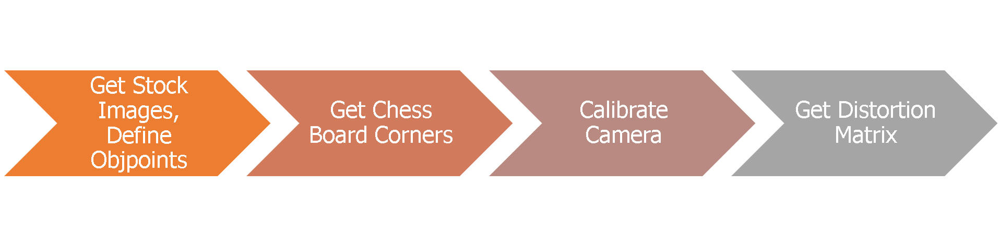

*   **Warp** - Use Warping Function to get Bird's eye view 
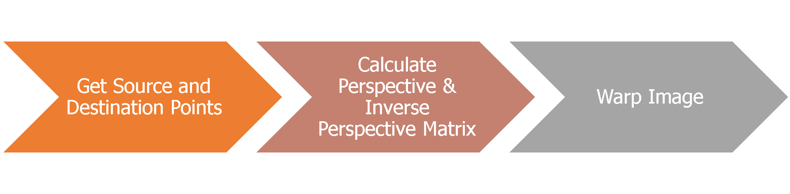

*   **Threshold** - Use a combination of static , dynamic thresholding with morph transformations & colorspaces to get thresholded image
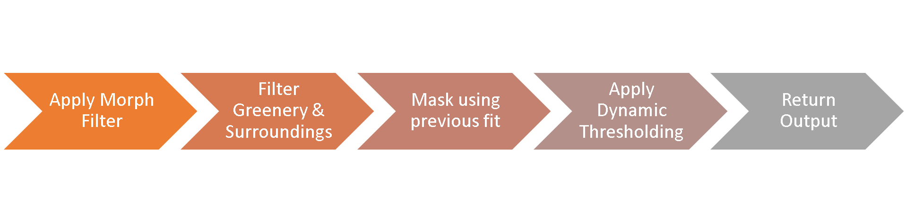

*   **Extract Pixel Information** - Use Quantity based thresholding to and extract non-zero pixels
*   **Validate and Fit** - Use Curvature and LaneWidth Sanity mechanisms to check the validity of the two fits obtained for a given frame and decide on whether to use the current fit or use an extrapolated average of the previous fits 
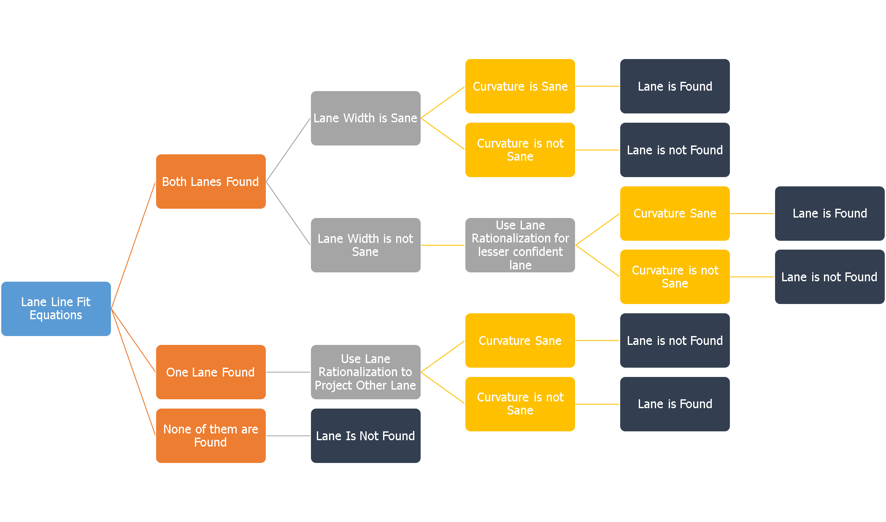
*   **Project Fit on to Image ** - Convert the x, y plane points and fit to image plane points and draw polygon on the image.
*   **Unwarp** - Use Inverse Perspective Transform to unwarp the image. 
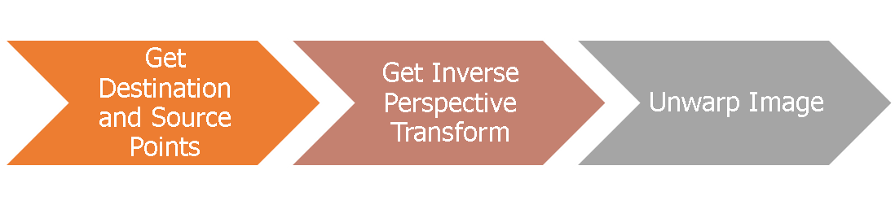

*   **Output** - Return the processed frame. 

### Example Images from Each of the video 
#### Harder Challenge
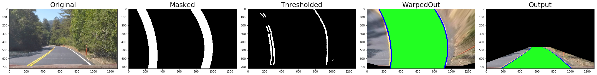
#### Challenge Video 

#### Project Video
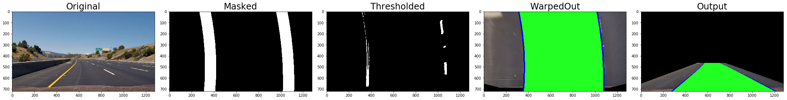

## Camera Calibration 
* Get Chessboard Corners from Standard Images
* Calibrate Camera using differences in distances between expected and actual results
* Use Calibration data to Undistort Camera Images
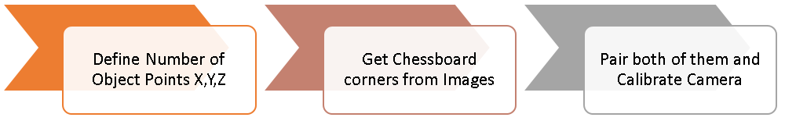
* Example of how Chessboard Corners are obtained before Calibration to Undstort and use it to have a Bird's Eye Perspective
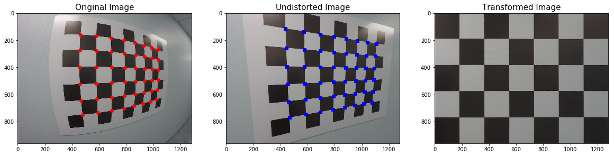

## Warping & Birds Eye View Generation
* Use Interactive Python to plot and understand what is the best set of source and destination points for each/ all the three videos of interest. After several days of experimentation we have finally arived at these numbers
* Use Get Perspective Transform for Matrix calculation that can be used to Warp The Image to Bird's eye view and Unwarp them back to the front view
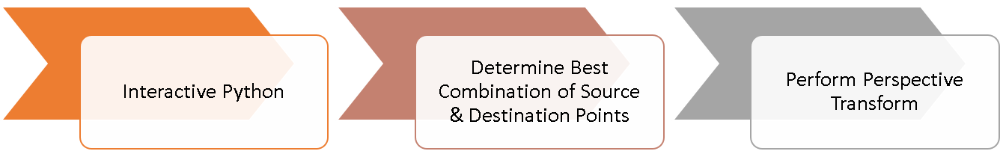

## Image Thresholding 
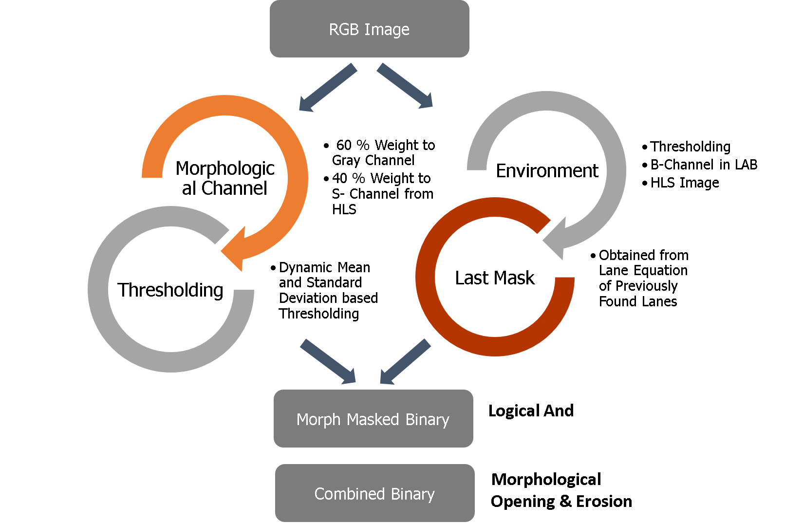
### Morphological Channel :
* Use HLS S- Channel and Gray Channel to create Morphological Channel
* Threshold the Morph Channel to get the most dominant features 
* Determine Levels of Thresholds using Mean and Standard Deviations 

### Environment Mask :
* Use B-Channel from the LAB Colorspace to choose Yellow and Shades of Yellow 
* Use HLS Channel to filter out everything not in range of threshold. "
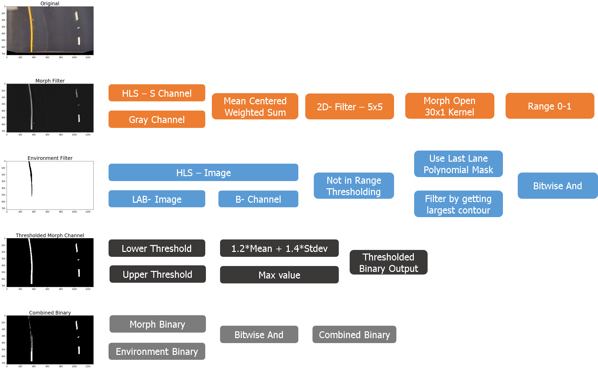

## Queue Helper Functions
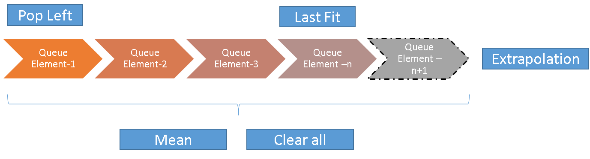
____________________________________
* Queues are extremely useful tools for First In First Out queues. 
* The size of the queues when they are really large can help stabilize values very well in case of noisy conditions
* The size of the queues can also slow down the speed at which the lanes 

### Fit Functions:
____________________
* **Mean Fit** : Get average fit over n-samples specified
* **Predicted Fit**: Extrapolate fit values if next sample is valid
* **Last Fit**: Last valid fit in the queue

### Curvature Functions:
___________________________
* **Mean Curvature** : Get average curvature over n-samples specified
* **Predicted Curvature**: Extrapolate curvature values if next sample is valid
* **Last Curvature**: Last valid curvature in the queue

### Other Functions:
____
* **Clear Queues**: Clear the queues completely
* **Pop Left**: Pop the left most value in the queues 

## Gif Outputs of all three processed videos
_____
### Project Video

### Challenge Video

### Harder Challenge Video

### Key Highlights
____
* Thresholding uses a combination of Morphological Transformations and Mean , Median , STDEV based dynamic thresholding
* Lane Width Rationalization and Dynamic Lane Width Updation to deal with optical illusion.
* State Machine to Handle decision on Found Lanes , and non-found lanes using queues and flags. 

### Challenges
____
* Absence of a great road model, absence of a great camera model - The road model would help understand what sort of a curve is sane , what isnt . What colors amount to false positives etc. Similarly the camera model should be designed to dynamically shift field of view and calculate the x and y distances keeping optical illusions in mind. 
* The result is extremely sensitive to Calibration ( Gains, Thresholds, Queue Lengths , Number of Segments etc.) Find the right combination of all these thresholds needed a plugin like Interactive Python .
* What works for one scenario may not work very well with the other. Using multiple scenarios for just the three videos would just amount to cheating, so developing a generic concept to handle most scenarios is the toughest part. 
* These challenges made me appreciate the concepts of deep learning augmenting classic computer vision techniques to process the image mathematically. 
* The entire project was built using global variables , queues and functions without the use of objects to make sure anyone who has just begun coding can read and understand the process easily.

### References
____
* Vivek Yadav  - https://github.com/vxy10 ( Blind Search & Masking )
* Parilo - https://github.com/parilo ( Exploration of Cubic Spline Fit ) 
*  Nikolas Ent - https://github.com/NikolasEnt ( Lane Width rationalization )

